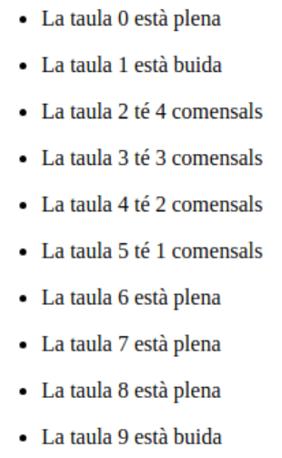
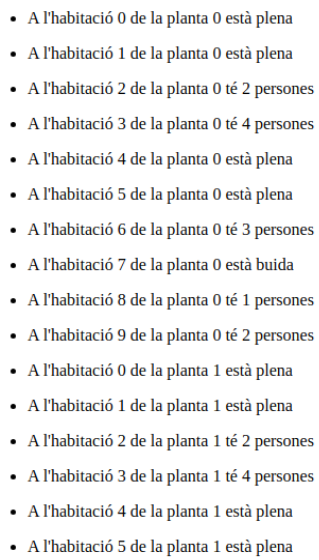

# Persona en PHP
1.El restaurant estarà format per 10 taules, on cada taula hi caben fins a 5 comensals. Volem una sortida a la terminal tal que: Recomanació: Feu, individualment o per parelles, el plantejament, sense codi, de la possible solució de l’exercici. 

2.Es tracta de programar la gestió d’habitacions d’un hotel. Imagineu un hotel amb 5 plantes i 10 habitacions en cadascuna de les plantes. Es vol guardar el nombre de clients que hi ha en cada habitació. Com a màxim hi pot haver 4 clients per habitació.Recomanació: Feu, individualment o per parelles, el plantejament, sense codi, de la possible solució de l’exercici. 

